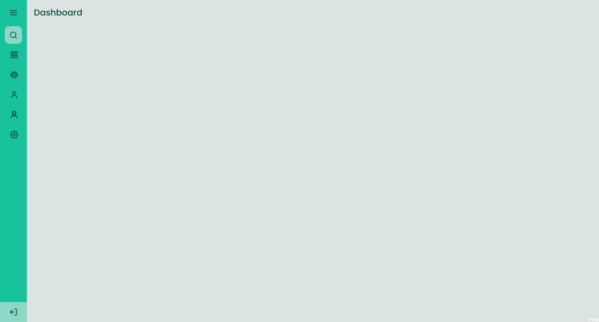

# Sidebar

Pré-visualização

<a href=''>Deploy</a>

<a href='https://efficient-sloth-d85.notion.site/Desafio-Sidebar-f2251eb4976941eb958326ea327ffeb9'>Link do desafio</a>

<h1>Sobre o Desafio</h1>

Nesse projeto, o objetivo é desenvolver uma sidebar que seja capaz de alterar o estado quando o usuário realizar alguma ação, entre elas a capacidade de esconder o texto e diminuir o tamanho para visualizar apenas os icones e quando aberta, que seja possivel visualizar textos e icones.

A construção da página é bem simples podendo ser feita utilizando apenas o básico do grid e flexbox. Nesse projeto eu tentei usar ao máximo do JavaScript e do posicionamento flexbox pra aprimorar os conhecimentos. Até o momento eu curti o resultado, acredito que esteja bem próximo do que foi solicitado.

<h2>Tecnologias utilizadas</h2>

# Sobre a Rocketseat🚀

A <a href='rocketseat.com.br'>Rocketseat</a> é uma escola de tecnologia com programas gratuitos para quem quer se especializar ou iniciar no mundo da programação.

